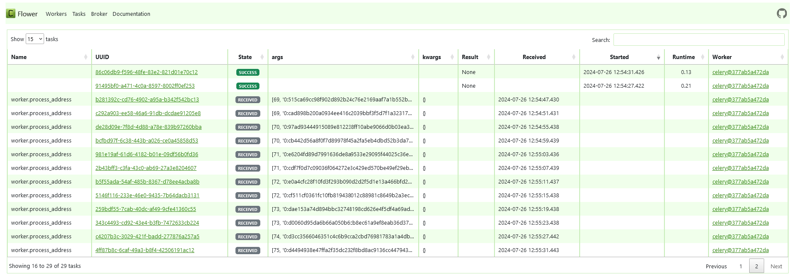

# PytoniqProject
Решение тестового задания для компании Artwell.

<p align="center">
  
  
  
  
</p>


## Как собрать и запустить проект?
Для сборки и запуска проекта, необходимо из главной дериктории (где располагается docker-compose.yml) 
проекта, выполнить следующую команду:
```
docker-compose up --build
```
Если необходимо только запустить контейнеры и не создавать их заного, 
то в этой же директории (где располагается docker-compose.yml),
необходимо выполнить следующую команду:
```
docker-compose start
```
Для остановки всех запущенных контейнеров:
```
docker-compose stop
```
## Как подключиться к базе данных postgres на хост-машине?
Для подклчения к базе данных я использовал клиент pgAdmin4,
в файле docker-compose.yml для проброса внутреннего порта 
контейнера 5432 использовался порт 5431, поэтому его необходимо
будет указать при подключении.
В клиенте pgAdmin4 необходимо в панели контекстного меню, перейти в Object-->Register-->Server,
после чего в качестве адреса подключения указать localhost, порт подключения: 5431,
а также все остальные данные указанные ниже.
Также при подключении использовались следующие данные указанные в .env.psgs:
```
POSTGRES_DB=postgres
POSTGRES_USER=postgres
POSTGRES_PASSWORD=postgres
```


<div align="center">
  
</div>

<p></p>

<div align="center">
  
</div>

<p></p>
При просмотре содержимого таблицы `contract_data` можно увидеть следующий
результат:

<div align="center">
  
</div>

## Просмотр очереди задач celery во flower.
Flower — небольшое веб-приложение, для мониторинга в real-time очередей задач,
а также управления ими.
Для того чтобы открыть клиент flower, откройте браузер на хост-машине,
и перейдите по адресу:
```
localhost:5555
```
В результате, в разделе tasks можно будет увидеть следующую картину:

<div align="center">
  
</div>

## Экспорт данных из БД postgres в формат json.
Для экспорта данных в json-формат, например таблицы contract_data, можно 
использовать следующую команду (из директории где располагается docker-compose.yml), 
запустив её из оболочки контейнера db_pytoniq:
```
docker-compose exec db_pytoniq psql -U postgres -d postgres -c "COPY (SELECT row_to_json(contract_data) FROM contract_data) TO STDOUT" > /var/lib/postgresql/data/contract_data.json
```

В результате будет создан файл с выгруженной таблицей contract_data.json,
в дериктории PytoniqProject/postgres_data:

<div align="center">
  
</div>

